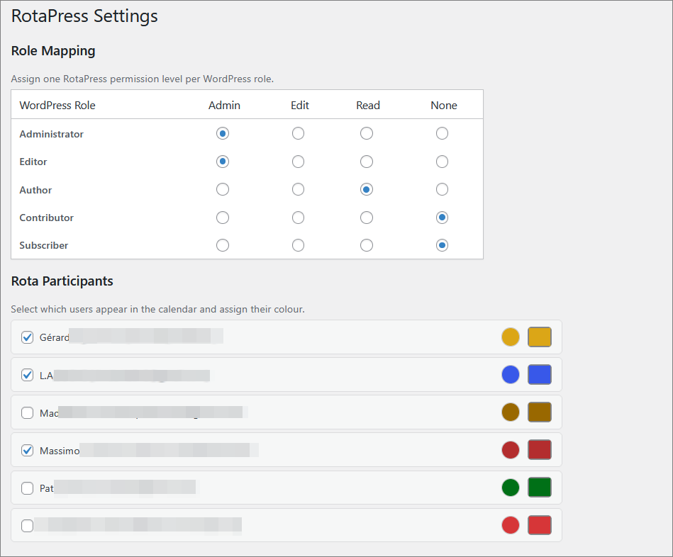
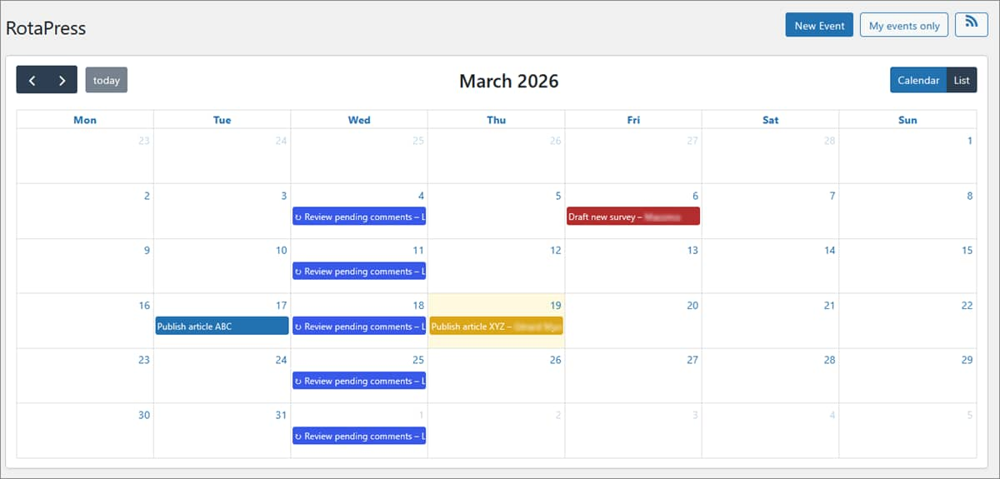
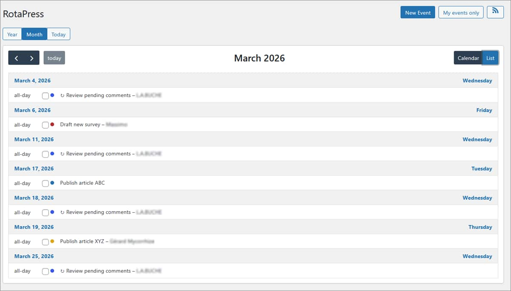
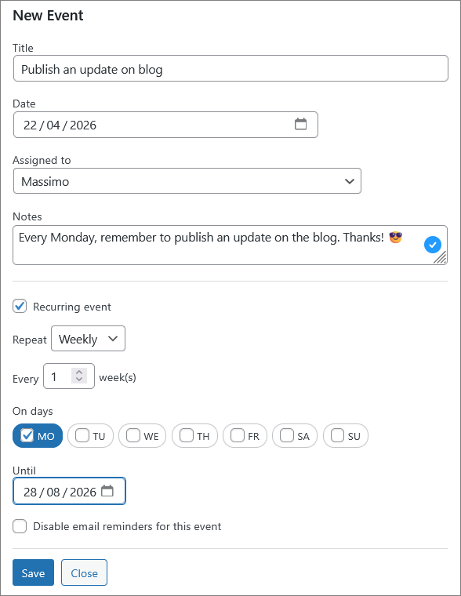
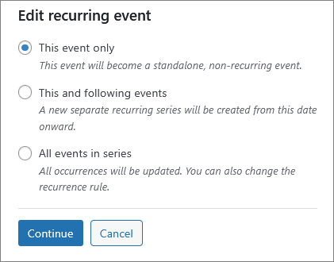
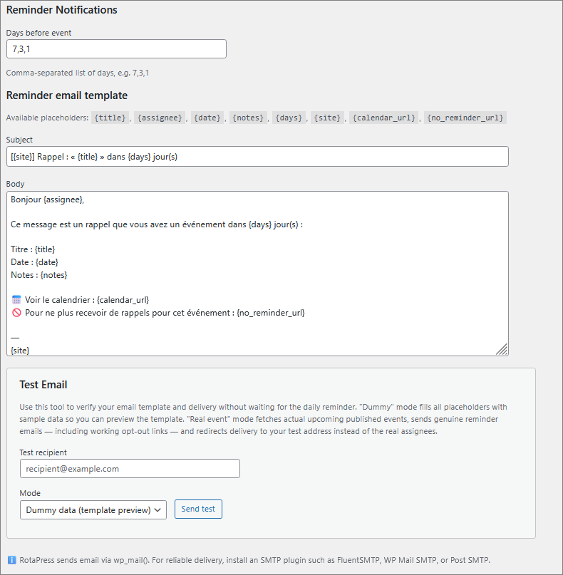

# RotaPress

Editorial rota calendar for WordPress — multi-author scheduling with role-based access, recurring events, email reminders, and personal iCal feed to connect to your personnal calendar.

**RotaPress** is a WordPress plugin that gives editorial teams a shared calendar to plan and track who publishes what, and when.
It's not always easy to keep track of publication schedules across multiple authors and it can quickly become chaotic, spreadsheets get outdated, emails get lost, and deadlines slip through the cracks. RotaPress solves this by embedding a simple visual editorial rota directly inside WordPress, where the work actually happens.


With RotaPress, an editor or team lead can:

- Schedule publication assignments on a shared calendar visible to all team members, showing who is responsible for each slot at a glance.
- Set up recurring schedules (daily, weekly, or monthly) for regular content slots, like a Monday morning column or a Friday roundup.
- Assign authors to specific dates with colour-coded events, so the calendar immediately communicates workload distribution across the team.
- Send automatic email reminders before upcoming deadlines, with customisable templates, so authors never forget a scheduled slot.
- Edit series flexibly — update a single occurrence, all future events, or an entire series..
- Bulk-manage events from a list view, select multiple events to reassign or delete in one clic.
- Subscribe via iCal — each author gets a personal, secure feed URL to sync their assigned events with any standard calendar app.
- Control access with role-based permissions. Decide which WordPress roles can view the calendar, edit events, or manage settings, without modifying WordPress core roles.
- Recover from mistakes — deleted events go to a 30-day trash with full restore capability.

RotaPress is not a publishing workflow tool like PublishPress for example, it doesn't control article drafts or post statuses. It's purely a scheduling layer: a shared rota that answers the simple question "who is writing what this week?" and makes sure everyone knows it.

## Requirements

- WordPress 6.3 or later
- PHP 8.0 or later

## Installation

1. Download latest release or clone this repository into `wp-content/plugins/rotapress/`.
2. Activate **RotaPress** from the WordPress Plugins admin page.
3. Navigate to **RotaPress → Settings** to configure role mapping and participants.


## Role Mapping

RotaPress defines three permission levels:

| Level | Capability | Access |
|-------|-----------|--------|
| **Admin** | `rotapress_admin` | Full access including settings |
| **Edit** | `rotapress_edit` | Create, edit, delete events |
| **Read** | `rotapress_read` | View the calendar only |

Capabilities are granted dynamically — no WordPress roles are modified in the database. By default:

- **Administrator** → Admin
- **Editor** → Edit
- **Author** → Read


You can customise the mapping in **RotaPress → Settings → Role Mapping** by checking the WordPress roles that should receive each RotaPress level.



*Screenshot setting - Role mapping and participants*


## Calendar Usage

- Click any date to create a new event (requires Edit permission).
- Click an existing event to view or edit it.
- Drag and drop to reschedule (disabled for recurring events).
- Use the **My events only** toggle to filter the calendar.
- Use the **Today** button in the toolbar to navigate back to the current date in the calendar view.
- Switch to list view using the **List** button in the toolbar, then use the **Year / Month / Today** buttons to filter events by scope.



*Screenshot Rota - Monthly calendar view*



*Screenshot Rota - List view with Year | Month | Today filters*


## Recurring Events

When creating an event, check **Recurring event** to configure:

- **Frequency**: Daily, Weekly, or Monthly
- **Interval**: Every N weeks/months
- **On days** (weekly only): Select specific weekdays
- **Until**: End date (required — no infinite recurrence)


*Screenshot Rota - Creating a new recurring event*


When editing or deleting a recurring event, you can choose to apply the change to:

- This event only (detaches the event from the series — it becomes independent)
- This and all following events
- All events in the series (allows editing the recurrence rule itself)



*Screenshot Rota - Editing a new recurring event*


## Email Reminders

RotaPress sends email reminders to assigned users before their scheduled events. Configure the reminder offsets in **Settings → Reminder Notifications** (default: 7, 3, 1 days before).

Emails are sent via `wp_mail()` and are compatible with any SMTP plugin.

### Email Template

Customise the subject and body in **Settings → Reminder email template**. The following placeholders are available: `{title}`, `{assignee}`, `{date}`, `{notes}`, `{days}`, `{site}`, `{calendar_url}`, `{no_reminder_url}`.

Use the **Test Email** tool in the same section to send a preview to any address without waiting for the daily cron run.

### Opt-out

Each reminder email includes a `{no_reminder_url}` link. Clicking it disables reminders for that specific event only, without affecting other events or requiring the user to log in.


*Screenshot setting - Email reminder parameters + test email function*


### Cron Configuration

WordPress cron depends on site traffic. For reliable reminder delivery, set up a real server cron job:

```
*/5 * * * * curl -s https://example.com/wp-cron.php?doing_wp_cron > /dev/null 2>&1
```

Or, using WP-CLI:

```
*/5 * * * * cd /path/to/wordpress && wp cron event run --due-now > /dev/null 2>&1
```

Note : it's recommended to add `define('DISABLE_WP_CRON', true);` to `wp-config.php` when using a server cron.


## iCal Feed

Each user gets a personal iCal feed URL containing only their assigned events. Find it by clicking the RSS icon in the calendar toolbar.

- The URL contains a secret token — keep it private.
- Add the URL to Google Calendar, Apple Calendar, Outlook, or any iCal-compatible app.
- Click **Regenerate** to create a new token (the old URL will stop working).

Note: for security reason, a person with the `rotapress_admin` role can revoke any active iCal feed on behalf of a user.


## Data Retention

By default, all RotaPress data (events, settings, tokens) is removed when you delete the plugin. To preserve data across reinstalls, enable **Keep all RotaPress data when the plugin is deleted** in Settings.


## Internationalization

RotaPress is fully translatable. A `.pot` file is included in `languages/rotapress.pot`. To translate:

1. Copy `rotapress.pot` to `rotapress-{locale}.po` (e.g. `rotapress-fr_FR.po`).
2. Translate using Poedit or a similar tool.
3. Generate the `.mo` file.
4. Place both files in the `languages/` directory.


## License

GPL v2 or later. See [LICENSE](https://www.gnu.org/licenses/gpl-2.0.html).


## Author

Thomas Mallié — [GitHub](https://github.com/Fluidetom/RotaPress)
